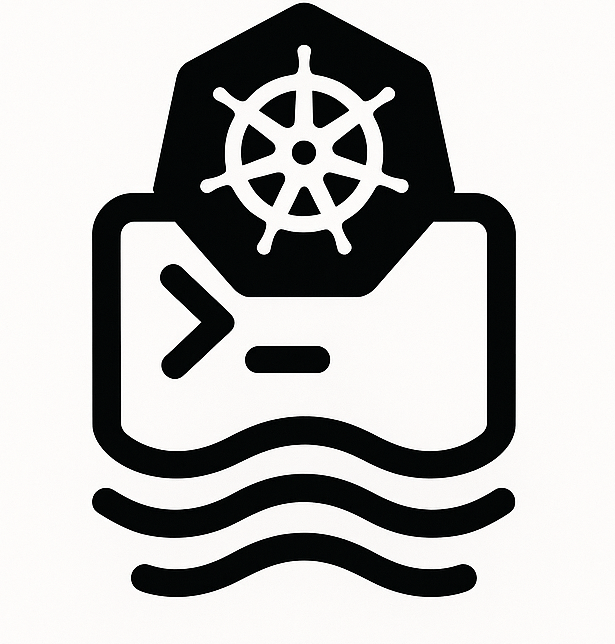

#  <span style="font-size: 48px;">Wake</span>

Wake is a command-line tool for tailing multiple pods and containers in Kubernetes clusters, inspired by [stern](https://github.com/stern/stern).

## Installation

### macOS (Homebrew)

```bash
brew install samba-rgb/wake/wake
```

### Building from Source

See the [Building from Source](#building-from-source) section below for detailed instructions.

## Features

- Multi-pod and container log tailing for Kubernetes
- **Interactive UI Mode** with dynamic filtering and real-time pattern updates
- **Advanced Pattern Syntax** with logical operators (AND, OR, NOT) for complex filtering
- **File Output Support** - save logs to files while optionally showing UI
- **Development Mode** - show internal application logs for debugging
- Color-coded output for easier log differentiation
- Advanced pattern filtering for pods and containers with logical operators
- Support for various Kubernetes resources (pods, deployments, statefulsets, etc.)
- Multiple output formats (text, json, raw)
- Timestamp support
- **Smart Filter Management** - old logs preserved when changing filters
- **Run Script in Pods** - execute scripts in pods and collect output

## Interactive UI Mode

Wake features a powerful interactive UI mode that allows dynamic filtering and real-time log viewing. **To use the interactive UI, add the `--ui` flag to your command.**

### Key Features
- **Real-time filtering** - Apply include/exclude patterns without restarting
- **Pattern history** - Navigate through previously used filter patterns
- **Visual feedback** - Clear indication of filter changes and their effects
- **Smart scrolling** - Auto-scroll to bottom with manual scroll support
- **Help system** - Built-in help accessible with `h` key

### UI Navigation
- **`i`** - Edit include pattern (show only logs matching this pattern)
- **`e`** - Edit exclude pattern (hide logs matching this pattern)
- **`h`** - Toggle help screen
- **`q` / `Esc`** - Quit application
- **`r`** - Refresh display
- **`↑/↓` or `k/j`** - Scroll through logs
- **`Home/Ctrl+g`** - Go to top
- **`End/G`** - Go to bottom
- **`Page Up/Down`** - Scroll by page

### Advanced Pattern Syntax

Wake supports sophisticated filtering patterns with logical operators:

#### Basic Examples
```bash
# Show only error logs
wake -n apps log-generator -i "error"

# Show only info logs  
wake -n apps log-generator -i "info"

# Show both info and error logs
wake -n apps log-generator -i "info|error"
```

#### Advanced Logical Operators
```bash
# Logical AND - logs must contain both patterns
wake -n apps log-generator -i 'info && "user"'

# Logical OR - logs containing either pattern
wake -n apps log-generator -i '"info" || "error"'

# Negation - exclude debug logs, show everything else
wake -n apps log-generator -i '!debug'

# Complex combinations with grouping
wake -n apps log-generator -i '(info || error) && !"test"'

# Exact text matching with quotes
wake -n apps log-generator -i '"error"'
```

#### Pattern Syntax Reference
- **`&&`** - Logical AND (both conditions must be true)
- **`||`** - Logical OR (either condition can be true)
- **`!`** - Logical NOT (negate the condition)
- **`()`** - Grouping for complex logic
- **`"text"`** - Exact text matching
- **`pattern`** - Regular expression matching

### Usage Examples

```bash
# Start interactive UI mode
wake -n kube-system "kube-proxy" --ui

# UI mode with initial filters
wake -n apps log-generator --ui -i "ERROR|WARN" -E "debug"

# UI mode with file output
wake -n apps log-generator --ui -w logs.txt
```

## File Output

Wake can save logs to files while optionally displaying them in the UI:

### Output Modes

```bash
# Save to file only (no UI)
wake -n apps log-generator -w logs.txt

# Save to file AND show UI
wake -n apps log-generator -w logs.txt --ui

# Different output formats to file
wake -n apps log-generator -w logs.json --output json
wake -n apps log-generator -w logs.txt --output raw --timestamps
```

### File Output Features
- **Real-time writing** - Logs written immediately as they arrive
- **Format support** - All output formats (text, json, raw) work with files
- **Filtering applied** - Only logs passing current filters are written to file
- **Simultaneous operation** - File writing works alongside UI display

## Development Mode

For debugging and development purposes, Wake includes a development mode that shows internal application logs:

```bash
# Enable development mode (shows internal logs even in UI)
wake -n apps log-generator --ui --dev

# Development mode in CLI
wake -n apps log-generator --dev
```

### Development Mode Benefits
- **Debug connection issues** - See Kubernetes connection details
- **Monitor pod discovery** - Watch how pods are found and selected
- **Performance insights** - View filtering and processing timings
- **Troubleshooting** - Detailed internal operation logs

## Buffer Management

Wake uses an intelligent buffer system to manage log storage in memory, especially important for UI mode and selection functionality:

### Buffer Configuration

```bash
# Default buffer size (20,000 lines)
wake -n apps log-generator --ui

# Larger buffer for longer history (30,000 lines)
wake -n apps log-generator --ui --buffer-size 30000

# High-capacity buffer for extensive selection (50,000 lines)  
wake -n apps log-generator --ui --buffer-size 50k

# Alternative format with 'k' suffix
wake -n apps log-generator --ui --buffer-size 30k
```

### Buffer Features
- **Automatic expansion** - Buffer doubles in size when entering selection mode
- **Memory efficient** - Old logs are rotated out when buffer limit is reached
- **Selection history** - Larger buffers allow selecting from more log history
- **Performance optimized** - Buffer size affects memory usage but not processing speed

### Buffer Size Recommendations
- **Default (10k)**: Good for general log viewing and basic selection
- **Medium (20k-30k)**: Better for extended selection and history browsing
- **Large (50k+)**: Best for comprehensive log analysis and long selection sessions

Note: Buffer size is specified as number of log entries, not bytes. Each log entry typically uses 100-500 bytes depending on content.

## Smart Filter Management

Wake intelligently handles filter changes:

- **Old logs preserved** - Changing filters doesn't remove previously displayed logs
- **Clear boundaries** - Visual markers show when filters were applied
- **New logs only** - Filter changes only affect incoming logs
- **Filter history** - Navigate through previously used patterns with arrow keys

## Running Scripts in Pods

Wake can run scripts in Kubernetes pods and collect the output. This feature is useful for debugging, maintenance, or any task that requires executing commands in the pod's environment.

### Script Execution Syntax

```bash
wake --script-in <path-to-script.sh> [--namespace <ns>] [--pod-selector <regex>] [--script-outdir <dir>]
```

- `--script-in <path-to-script.sh>`: Path to the script file to be executed in the pods.
- `--namespace <ns>`: (Optional) Kubernetes namespace. Default is `default`.
- `--pod-selector <regex>`: (Optional) Regex to select pods. Default is all pods.
- `--script-outdir <dir>`: (Optional) Directory to save script output. Default is a timestamped directory in the current location.

### Output Files

For each pod, the output will be saved as:
- `<namespace>_<pod>.stdout.txt`: Standard output of the script.
- `<namespace>_<pod>.stderr.txt`: Standard error of the script.

These files are saved in a directory named like `wake_output_YYYYMMDD_HHMMSS/` by default.

### Setting Default Output Directory

You can set a default output directory for script results with:

```bash
wake setconfig script_outdir /path/to/dir
```

This directory will be used for all future script executions unless overridden by `--script-outdir`.

### Example

```bash
wake --script-in ./dummy_script.sh --namespace apps --pod-selector 'nginx.*' --script-outdir ./results
```

This command runs `dummy_script.sh` in all pods in the `apps` namespace that match the `nginx.*` regex, and saves the output in the `./results` directory.

## Next Steps

The following enhancements are planned for future versions:

1. **Resource Detection for Filtering**: Implement comprehensive detection and filtering for Kubernetes resource types:
   - Deployments, StatefulSets, DaemonSets, Jobs, and CronJobs
   - Label-based selection for all resource types
   - Support for resource field selectors

2. **Custom Output Templates**: Add support for user-defined output templates:
   - Go template-like syntax for customizing log output format
   - Template functions for JSON parsing, timestamp formatting
   - Template loading from external files

3. **Testing Framework**: Implement comprehensive tests:
   - Unit tests for core functionality
   - Integration tests with minikube/kind clusters
   - Mock Kubernetes API for testing without a real cluster

4. **Configuration File Support**: Add support for configuration files:
   - YAML configuration format
   - Config loading from standard paths (~/.config/wake/config.yaml)
   - Environment variable overrides

5. **Shell Completion Scripts**:
   - Bash, Zsh, and Fish completion scripts
   - Dynamic completion for namespaces and contexts

6. **Label Filtering Support**:
   - Filter pods by label selectors
   - Support for label expressions and operators
   - Autocomplete for commonly used labels

## Installation

### Prerequisites

- Rust toolchain (1.70.0 or later)
  ```bash
  curl --proto '=https' --tlsv1.2 -sSf https://sh.rustup.rs | sh
  ```
- Git

### Building from source

1. Clone the repository:
   ```bash
   git clone https://github.com/amba-rgb/wake.git
   cd wake
   ```

2. Build the project:
   ```bash
   # Development build
   cargo build

   # Release build with optimizations
   cargo build --release
   ```

   The binary will be available at:
   - Development build: `target/debug/wake`
   - Release build: `target/release/wake`

3. Run tests (optional):
   ```bash
   cargo test
   ```

### Installation

After building, you can install the binary to your system:

```bash
# Install to ~/.cargo/bin
cargo install --path .

# Or copy the release binary to a location in your PATH
cp target/release/wake ~/.local/bin/
```

### Development Setup

1. Configure your development environment:
   ```bash
   # Set up git hooks
   cargo install cargo-husky
   cargo husky install

   # Install development dependencies
   cargo install cargo-watch  # For auto-recompilation
   cargo install cargo-audit  # For security auditing
   ```

2. Development workflow:
   ```bash
   # Auto-rebuild on changes
   cargo watch -x build

   # Run tests in watch mode
   cargo watch -x test

   # Check code formatting
   cargo fmt --all -- --check

   # Run linter
   cargo clippy
   ```

For setting up a local Kubernetes test environment with sample applications, see the [Development Environment Guide](dev/README.md).

## Usage

```bash
# Tail logs from all pods in the default namespace
wake

# Tail logs from pods matching 'nginx' in the 'web' namespace
wake -n web nginx

# Tail logs from containers matching 'app' in pods matching 'frontend'
wake frontend -c app

# Show logs with timestamps
wake -T

# Output logs as JSON
wake -o json

# Use a regex pattern to filter logs
wake -n monitoring -i "error|warning"
```

### CLI Options

```
Options:
  -n, --namespace <NAMESPACE>     Kubernetes namespace [default: default]
  -A, --all-namespaces            Show logs from all namespaces
  -c, --container <CONTAINER>     Container selector regex [default: .*]
  -k, --kubeconfig <KUBECONFIG>   Path to kubeconfig file
  -x, --context <CONTEXT>         Kubernetes context to use
  -t, --tail <TAIL>               Lines of logs to display from beginning [default: 10]
  -f, --follow                    Follow logs (stream in real time) [default: true]
  -i, --include <INCLUDE>         Filter logs using advanced pattern syntax (supports &&, ||, !, quotes, regex)
  -E, --exclude <EXCLUDE>         Exclude logs using advanced pattern syntax (supports &&, ||, !, quotes, regex)
  -T, --timestamps                Show timestamps in logs
  -o, --output <OUTPUT>           Output format (text, json, raw) [default: text]
  -w, --output-file <FILE>        Write logs to file (use with --ui for both file and UI)
  -r, --resource <RESOURCE>       Use specific resource type filter (pod, deployment, statefulset)
      --template <TEMPLATE>       Custom template for log output
      --since <SINCE>             Since time (e.g., 5s, 2m, 3h)
      --threads <THREADS>         Number of threads for log filtering
      --buffer-size <SIZE>        Number of log entries to keep in memory [default: 20000]
      --ui                        Enable interactive UI mode with dynamic filtering
      --dev                       Enable development mode (show internal logs)
  -v, --verbosity <VERBOSITY>     Verbosity level for debug output [default: 0]
  -L, --list-containers           List all containers in matched pods
      --all-containers            Show logs from all containers in pods
      --script-in <PATH>          Path to a script to run in each selected pod (copied and executed as /tmp/wake-script.sh)
      --script-outdir <DIR>       Directory to save script output tar (overrides config)
  -h, --help                      Print help
  -V, --version                   Print version
```

## Understanding Pod Selectors

The pod selector is a powerful feature that lets you filter which pods to watch. It accepts regular expressions (regex) for flexible matching:

### Pod Selector Examples

```bash
# Watch all pods that start with 'nginx'
wake nginx.*

# Watch specific numbered pods (e.g., web-1, web-2)
wake web-[0-9]+

# Watch multiple specific pods
wake '(auth|api|frontend).*'

# Watch all pods in a specific namespace that contain 'mysql'
wake -n database .*mysql.*

# Combine with container selection
wake nginx.* -c 'main|sidecar'
```

The pod selector is specified as a positional argument and uses standard regex syntax:
- `.*` matches any character sequence (e.g., `nginx.*` matches nginx-1234, nginx-abc, etc.)
- `[0-9]` matches any digit
- `+` means "one or more" of the previous pattern
- `|` means "or" (e.g., `(api|web)` matches either api or web)
- `^` matches start of name, `$` matches end of name

### Best Practices
- Start with broader patterns and narrow them down if needed
- Use the `-v` flag to see which pods are being matched
- Combine with `--container` flag to target specific containers within matched pods
- When using special regex characters, quote your pattern: `wake '(api|web).*'`

## Using Resource Type Selectors

In addition to using regular expressions to select pods, Wake supports selecting pods based on their parent Kubernetes resources. This feature helps you easily watch logs from specific Deployments, StatefulSets, or other resource types without knowing the exact pod names.

### Resource Selector Examples

```bash
# Watch logs from all pods owned by a specific deployment
wake -r deployment/nginx

# Watch logs from a statefulset
wake -r statefulset/mysql

# Watch logs from a daemonset
wake -r daemonset/monitoring-agent

# Watch logs from a specific job
wake -r job/backup-job

# Use shorthand names for resources
wake -r deploy/frontend
wake -r sts/database
wake -r ds/logging-agent
```

### Supported Resource Types

- **pod**: Direct pod selection by name
- **deployment** (alias: deploy): Select pods managed by a Deployment
- **replicaset** (alias: rs): Select pods managed by a ReplicaSet
- **statefulset** (alias: sts): Select pods managed by a StatefulSet
- **daemonset** (alias: ds): Select pods managed by a DaemonSet
- **job**: Select pods owned by a Job

### Combining With Other Selectors

Resource selectors can be combined with container selectors for more precise targeting:

```bash
# Watch the 'api' container in any pod from the 'frontend' deployment
wake -r deployment/frontend -c api

# Watch all containers in pods from the 'database' statefulset
wake -r sts/database --all-containers
```

## License

MIT License