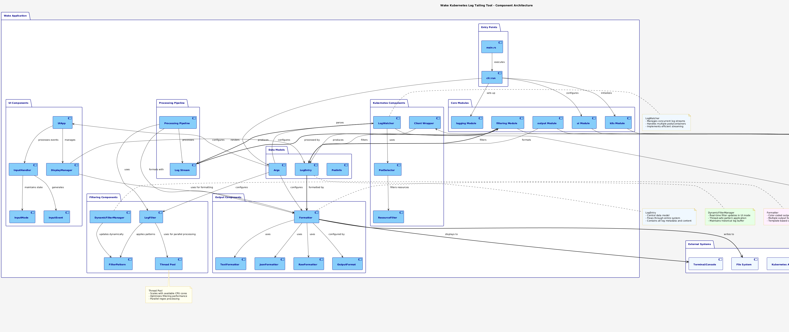
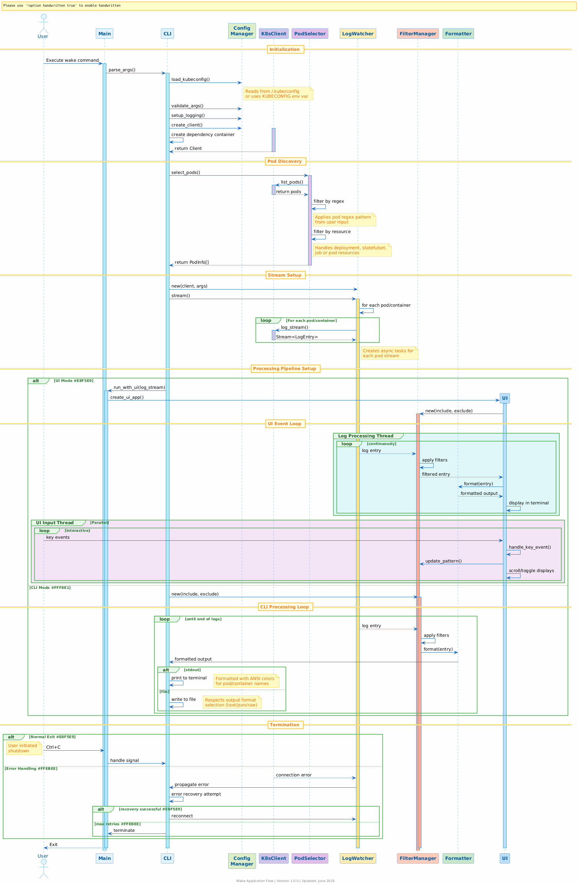

# Wake Architecture

Wake is a command-line tool for tailing multiple pods and containers in Kubernetes clusters, inspired by [stern](https://github.com/stern/stern).

## Project Structure

```
wake/
├── Cargo.toml            # Project configuration and dependencies
├── LICENSE               # MIT license file
├── README.md            # Project documentation
├── src/                  # Source code directory
│   ├── main.rs           # Application entry point
│   ├── cli/              # Command-line interface components
│   │   ├── args.rs       # CLI argument definitions
│   │   └── mod.rs        # CLI module organization
│   ├── filtering/        # Log filtering components
│   │   └── mod.rs        # Multi-threaded filtering implementation
│   ├── k8s/              # Kubernetes interaction components
│   │   ├── client.rs     # Kubernetes client creation
│   │   ├── logs.rs       # Log streaming functionality
│   │   ├── mod.rs        # K8s module organization
│   │   ├── pod.rs        # Pod selection and filtering
│   │   ├── resource.rs   # Resource type handling (deployments, etc.)
│   │   └── selector.rs   # Selector creation for filtering
│   ├── logging/          # Log processing components
│   │   └── mod.rs        # Logging module organization
│   ├── output/           # Output formatting components
│   │   ├── formatter.rs  # Log entry formatting implementation
│   │   └── mod.rs        # Output module organization
│   └── ui/               # Interactive UI components
│       ├── app.rs        # Main UI application
│       ├── display.rs    # Terminal UI display manager
│       ├── filter_manager.rs # Dynamic filter management
│       ├── input.rs      # User input handling
│       └── mod.rs        # UI module organization
```

## Code Flow

1. **Program Entry (`main.rs`)**: 
   - Sets up logging via `tracing_subscriber`
   - Sets up signal handling for graceful termination
   - Parses command line arguments
   - Calls `cli::run()` to execute the main program logic

2. **CLI Execution (`cli/mod.rs`)**: 
   - Initializes the Kubernetes client
   - Creates a log watcher
   - Sets up the output formatter
   - Processes streams of logs

3. **Kubernetes Client (`k8s/client.rs`)**:
   - Creates a Kubernetes client from default config or specified kubeconfig

4. **Log Watching (`k8s/logs.rs`)**:
   - Defines the `LogWatcher` which manages log streaming
   - Defines the `LogEntry` struct to represent each log line
   - Handles streaming logs from multiple pods and containers

5. **Pod Selection (`k8s/pod.rs`)**:
   - Selects pods based on regex patterns
   - Defines the `PodInfo` struct to store pod metadata
   - Handles listing pods across namespaces

6. **Resource Handling (`k8s/resource.rs`)**:
   - Defines the `ResourceType` enum for different Kubernetes resources
   - Converts resource types to pod selectors
   - Handles querying different resource types (Deployment, StatefulSet, etc.)

7. **Log Processing (`logging/mod.rs`)**:
   - Processes streams of log entries
   - Sets up signal handlers for graceful termination
   - Writes formatted logs to stdout

8. **Output Formatting (`output/mod.rs`)**:
   - Formats log entries for display
   - Supports different output formats (text, JSON, raw)
   - Handles color coding for different pods and containers

9. **Interactive UI Mode (`ui/mod.rs`)**:
   - Provides terminal-based user interface using `ratatui`
   - Allows real-time filtering without restarting the application
   - Handles keyboard input and displays logs with scrolling capabilities

## Component Diagram



```
┌────────────────────────────────────────────────────┐
│                      Args                          │
├────────────────────────────────────────────────────┤
│ pod_selector: String                               │
│ container: String                                  │
│ namespace: String                                  │
│ all_namespaces: bool                               │
│ kubeconfig: Option<PathBuf>                        │
│ context: Option<String>                            │
│ tail: i64                                          │
│ follow: bool                                       │
│ include: Option<String>                            │
│ exclude: Option<String>                            │
│ timestamps: bool                                   │
│ output: String                                     │
│ resource: Option<String>                           │
│ template: Option<String>                           │
│ since: Option<String>                              │
│ verbosity: u8                                      │
├────────────────────────────────────────────────────┤
│ pod_regex(): Result<Regex>                         │
│ container_regex(): Result<Regex>                   │
│ include_regex(): Option<Result<Regex>>             │
│ exclude_regex(): Option<Result<Regex>>             │
└────────────────────────────────────────────────────┘

┌────────────────────────────────────────────────────┐
│                    LogWatcher                      │
├────────────────────────────────────────────────────┤
│ client: Client                                     │
│ args: Arc<Args>                                    │
├────────────────────────────────────────────────────┤
│ new(client: Client, args: &Args): Self             │
│ stream(): Future<Result<Stream<Item = LogEntry>>>  │
└────────────────────────────────────────────────────┘

┌────────────────────────────────────────────────────┐
│                    LogEntry                        │
├────────────────────────────────────────────────────┤
│ namespace: String                                  │
│ pod_name: String                                   │
│ container_name: String                             │
│ message: String                                    │
│ timestamp: Option<DateTime<Utc>>                   │
└────────────────────────────────────────────────────┘

┌────────────────────────────────────────────────────┐
│                    LogFilter                       │
├────────────────────────────────────────────────────┤
│ include_pattern: Option<Arc<Regex>>                │
│ exclude_pattern: Option<Arc<Regex>>                │
│ thread_pool: ThreadPool                            │
├────────────────────────────────────────────────────┤
│ new(...): Self                                     │
│ start_filtering(): mpsc::Receiver<LogEntry>        │
│ recommended_threads(): usize                       │
└────────────────────────────────────────────────────┘

┌────────────────────────────────────────────────────┐
│                    PodInfo                         │
├────────────────────────────────────────────────────┤
│ namespace: String                                  │
│ name: String                                       │
│ containers: Vec<String>                            │
└────────────────────────────────────────────────────┘

┌────────────────────────────────────────────────────┐
│                    Formatter                       │
├────────────────────────────────────────────────────┤
│ output_format: OutputFormat                        │
│ include_pattern: Option<Regex>                     │
│ exclude_pattern: Option<Regex>                     │
│ show_timestamps: bool                              │
│ pod_colors: Mutex<HashMap<String, Color>>          │
│ container_colors: Mutex<HashMap<String, Color>>    │
├────────────────────────────────────────────────────┤
│ new(args: &Args): Self                             │
│ format(&self, entry: &LogEntry): Option<String>    │
└────────────────────────────────────────────────────┘

┌────────────────────────────────────────────────────┐
│                  ResourceType                      │
├────────────────────────────────────────────────────┤
│ Pod                                                │
│ Deployment                                         │
│ ReplicaSet                                         │
│ StatefulSet                                        │
│ Job                                                │
├────────────────────────────────────────────────────┤
│ from_str(s: &str): Option<Self>                    │
└────────────────────────────────────────────────────┘

┌────────────────────────────────────────────────────┐
│                  InputHandler                      │
├────────────────────────────────────────────────────┤
│ mode: InputMode                                    │
│ include_input: String                              │
│ exclude_input: String                              │
│ cursor_position: usize                             │
│ input_history: VecDeque<String>                    │
│ history_index: Option<usize>                       │
├────────────────────────────────────────────────────┤
│ new(initial_include, initial_exclude): Self        │
│ handle_key_event(key: KeyEvent): Option<InputEvent>│
│ get_help_text(): Vec<&'static str>                 │
└────────────────────────────────────────────────────┘

┌────────────────────────────────────────────────────┐
│                DisplayManager                      │
├────────────────────────────────────────────────────┤
│ log_lines: VecDeque<String>                        │
│ scroll_offset: usize                               │
│ max_lines: usize                                   │
│ total_logs: usize                                  │
│ filtered_logs: usize                               │
│ formatter: Formatter                               │
├────────────────────────────────────────────────────┤
│ new(max_lines: usize, timestamps: bool): Result<Self>│
│ add_log_entry(entry: &LogEntry)                    │
│ add_system_message(message: &str)                  │
│ scroll_up/down/to_top/to_bottom()                  │
│ render(f: &mut Frame, input_handler: &InputHandler)│
└────────────────────────────────────────────────────┘

┌────────────────────────────────────────────────────┐
│                 DynamicFilterManager               │
├────────────────────────────────────────────────────┤
│ include_pattern: Arc<RwLock<Option<Arc<Regex>>>>   │
│ exclude_pattern: Arc<RwLock<Option<Arc<Regex>>>>   │
│ log_buffer: Arc<RwLock<Vec<LogEntry>>>             │
│ buffer_size: usize                                 │
├────────────────────────────────────────────────────┤
│ new(initial_include, initial_exclude): Result<Self>│
│ update_include/exclude_pattern(pattern: Option<String>) │
│ should_include(entry: &LogEntry): bool             │
│ add_to_buffer(entry: LogEntry)                     │
│ start_filtering(input_rx): Receiver<LogEntry>      │
└────────────────────────────────────────────────────┘

## Data Flow



```
                                   ┌───────────────┐
                                   │    main.rs    │
                                   │ Program Entry │
                                   └───────┬───────┘
                                           │
                                           ▼
                        ┌──────────────────────────────────┐
                        │          cli::parse_args         │
                        │      Parse Command-line Args     │
                        └──────────────────┬───────────────┘
                                           │
                                           ▼
                        ┌──────────────────────────────────┐
                        │           cli::run               │
                        │     Main Application Logic       │
                        └──────────────────┬───────────────┘
                                           │
                        ┌──────────────────┼──────────────────┐
                        │                  │                  │
                        ▼                  ▼                  ▼
┌──────────────────────────────┐ ┌─────────────────────┐ ┌───────────────────────────┐
│     k8s::create_client       │ │  k8s::LogWatcher    │ │    output::Formatter      │
│ Initialize Kubernetes client │ │ Set up Log Watching │ │ Configure Output Formatter│
└──────────────┬───────────────┘ └─────────┬───────────┘ └───────────────┬───────────┘
               │                           │                             │
               │                           ▼                             │
               │             ┌─────────────────────────┐                 │
               └────────────►│    k8s::pod::select_pods│                 │
                             │  Find matching pods     │                 │
                             └────────────┬────────────┘                 │
                                          │                              │
                                          ▼                              │
                             ┌─────────────────────────┐                 │
                             │ LogWatcher::stream      │                 │
                             │ Stream logs from pods   │                 │
                             └────────────┬────────────┘                 │
                                          │                              │
                                          ▼                              ▼
                            ┌──────────────────────────────────────────────┐
                            │           logging::process_logs              │
                            │    Process & format logs for display         │
                            └──────────────────────┬───────────────────────┘
                                                  │
                                                  ▼
                       ┌─────────────────────────────────────────────────┐
                       │              UI / CLI Mode Split                │
                       └───────────────┬─────────────────┬───────────────┘
                                       │                 │
                                       ▼                 ▼
    ┌─────────────────────────────────────────┐  ┌───────────────────────────────────┐
    │            ui::run_with_ui              │  │      filtering::LogFilter         │
    │   Terminal UI with interactive filters  │  │   OS thread-based log filtering   │
    └────────────────────┬──────────────────┬─┘  └───────────────────┬───────────────┘
                         │                  │                        │
                         ▼                  │                        ▼
    ┌─────────────────────────────────────┐ │            ┌────────────────────────┐
    │      ui::DisplayManager::render     │ │            │  Formatter::format     │
    │     Terminal rendering with ratatui │ │            │  Format each log entry │
    └─────────────────────────────────────┘ │            └────────────┬───────────┘
                                            │                         │
                                            ▼                         ▼
                          ┌────────────────────────────┐   ┌────────────────────────┐
                          │   ui::InputHandler         │   │     stdout output      │
                          │ Process keyboard input     │   │    Display to user     │
                          └────────────────────────────┘   └────────────────────────┘
```

## Key Dependencies

- **kube**: Kubernetes client for Rust
- **tokio**: Asynchronous runtime
- **futures**: Stream processing utilities
- **clap**: Command-line argument parsing
- **tracing**: Logging and diagnostics
- **colored**: Terminal color handling
- **regex**: Regular expression matching
- **serde_json**: JSON serialization/deserialization
- **threadpool**: Thread pool for parallel log filtering
- **num_cpus**: CPU detection for optimal thread allocation
- **ratatui**: Terminal UI framework for interactive viewing
- **crossterm**: Terminal manipulation and event handling

## Multi-threaded Filtering System

Wake now includes a specialized OS thread-based filtering system for high-performance log filtering. This enhancement significantly improves performance when dealing with large log volumes by:

1. **Thread Pool Utilization**: 
   - Uses a dedicated thread pool to parallelize regex pattern matching
   - Automatically scales based on available CPU cores
   - Configurable via CLI argument for thread count customization

2. **Two-Phase Filtering**:
   - Asynchronous collection of logs from Kubernetes API using Tokio
   - Parallel filtering of log messages using native OS threads
   - Non-blocking communication between async runtime and thread pool workers

3. **Performance Optimization**:
   - Offloads regex computation to separate threads to avoid blocking the async runtime
   - Uses lock-free channels for efficient inter-thread communication
   - Employs batch processing for reduced synchronization overhead

4. **Memory Management**:
   - Efficiently shares regex patterns between threads using Arc<Regex>
   - Uses oneshot channels to minimize memory overhead for task communication
   - Implements backpressure handling through bounded channels

This architecture provides significant performance improvements for log filtering operations, especially when working with complex regex patterns or high-volume log streams, all while maintaining a clean separation of concerns in the codebase.

## Interactive UI Architecture

Wake now features a powerful interactive terminal user interface (TUI) mode that enhances the user experience when working with logs:

1. **Real-time Filter Management**:
   - Update include/exclude patterns without restarting
   - Instantly see results as filters are applied
   - View filter statistics for total vs. filtered log count
   - Access filter history for quick recall of previous patterns

2. **Terminal UI Components**:
   - Three-panel layout (filter area, log area, status bar)
   - Dynamic color-coding of logs by pod and container
   - Scrollable log view with keyboard navigation
   - Interactive help overlay accessed via keyboard shortcut

3. **Input Handling System**:
   - Modal input system (normal, editing, help modes)
   - Keyboard shortcuts for all common operations
   - Command history for quick reuse of previous patterns
   - Active cursor for text editing in filter fields

4. **Dynamic Log Buffer**:
   - Circular log buffer retains recent logs
   - Re-filterable without needing to reconnect to K8s
   - Configurable buffer size to balance memory use and history
   - Thread-safe design using Arc<RwLock<>> for shared access

5. **UI/Processing Separation**:
   - Event loop for UI rendering separate from log processing
   - Non-blocking architecture prevents UI freezing during processing
   - Clean separation between data processing and presentation

This UI architecture makes Wake not just a log tailing tool but a complete interactive log exploration environment, allowing users to dynamically refine their view of Kubernetes logs without disrupting their workflow.