# Wake Complete Architecture - UML Diagrams

This document provides comprehensive UML diagrams for the Wake Kubernetes log tailing tool architecture, covering every component, relationship, and data flow.

## 1. High-Level System Architecture

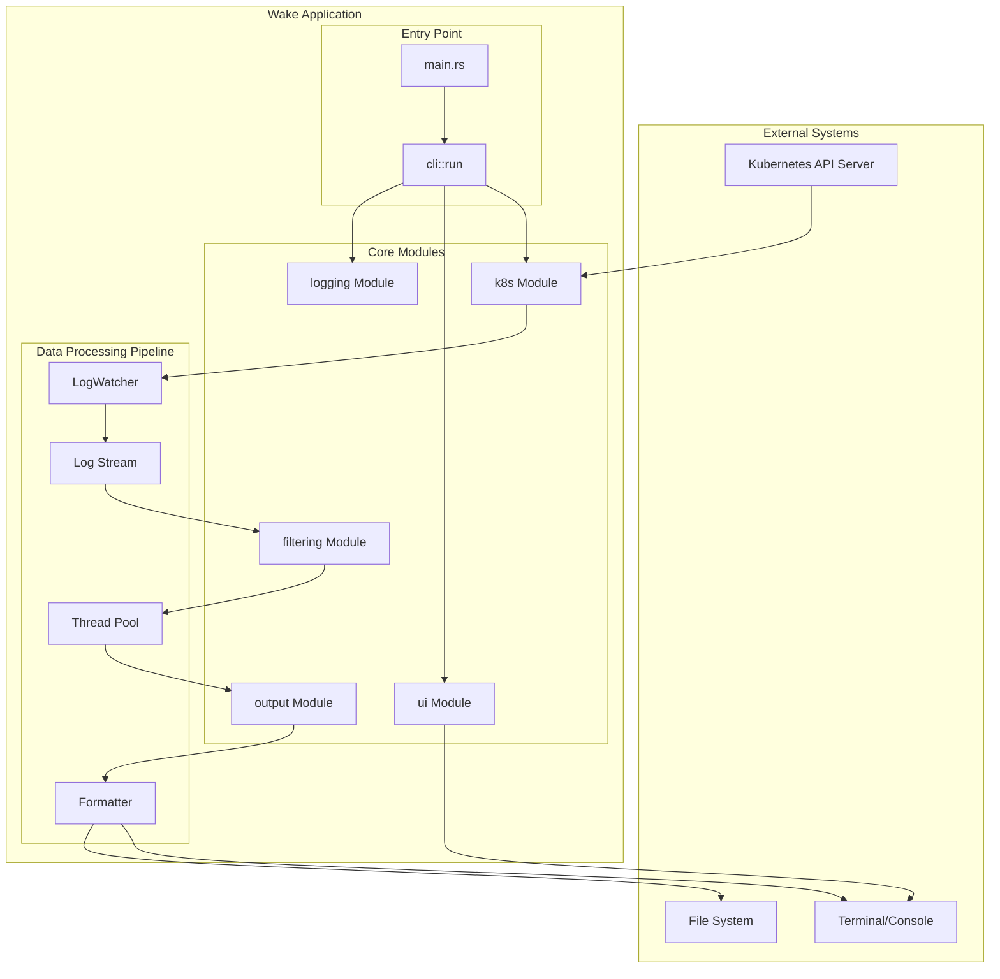

## 2. Core Data Models Class Diagram

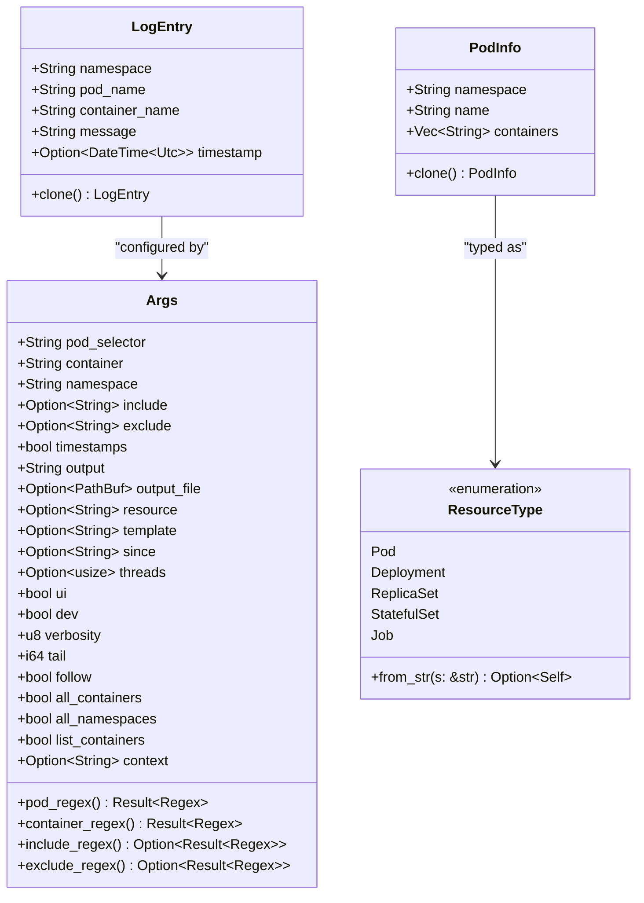

## 3. Kubernetes Integration Module

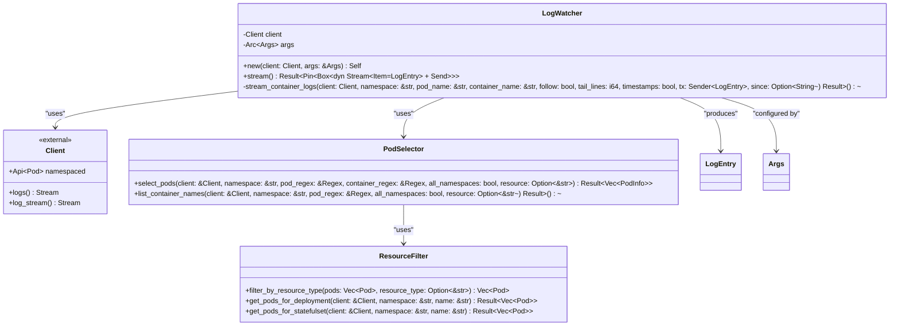

## 4. Filtering System Architecture

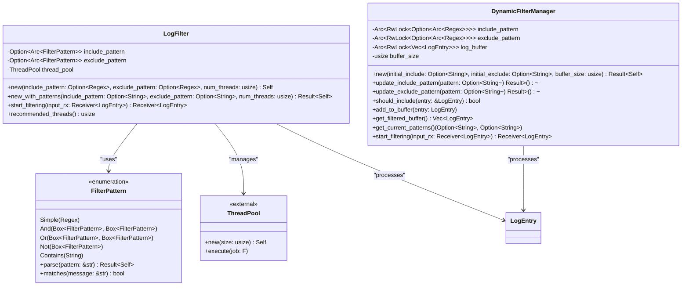

## 5. Output System Architecture

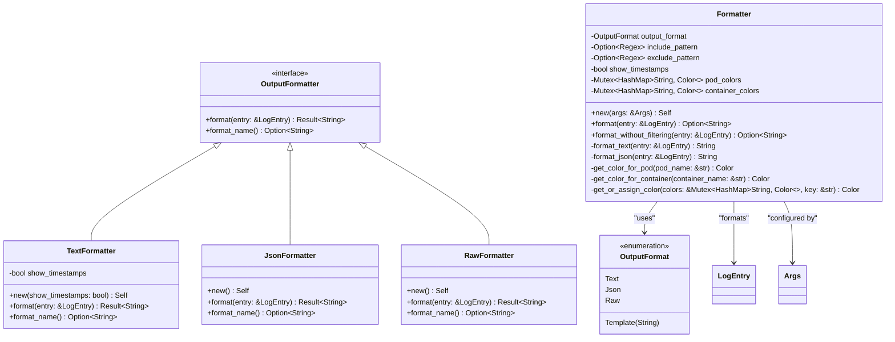

## 6. UI Module Architecture

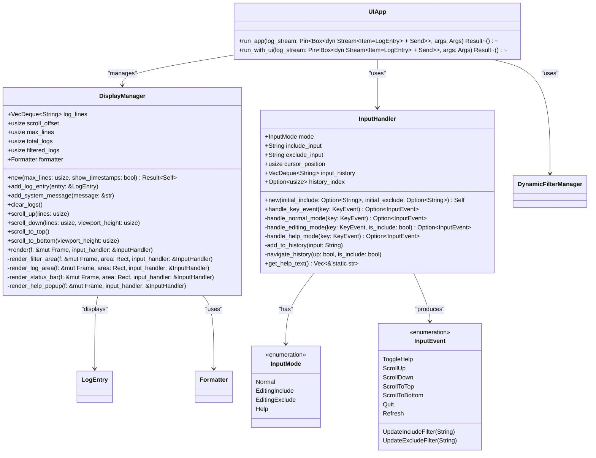

## 7. Logging and Processing Module

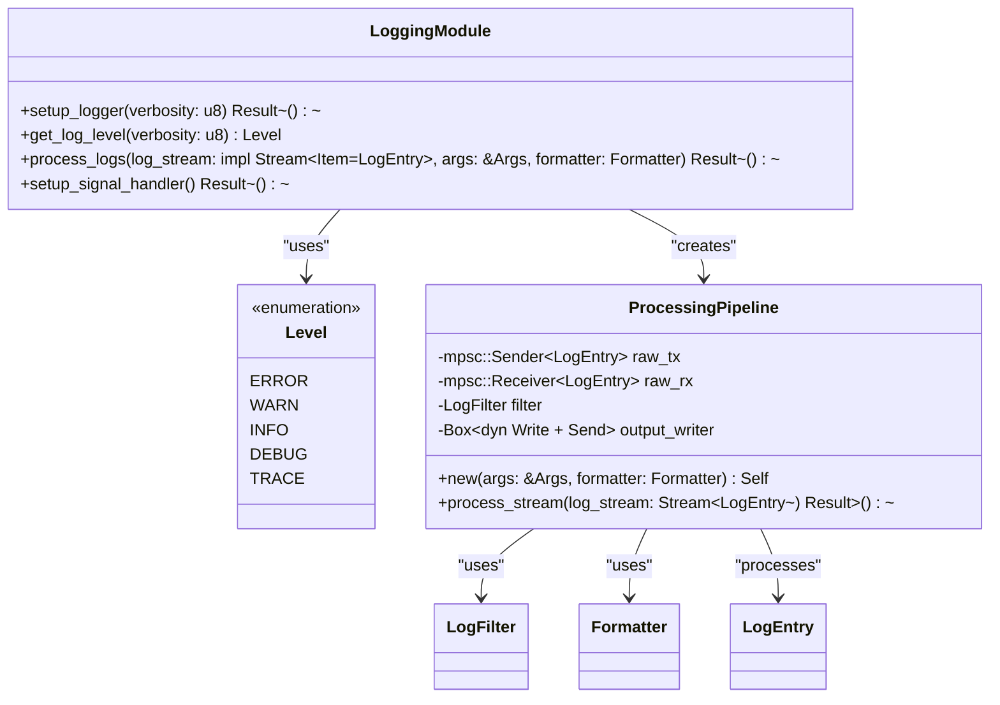

## 8. Complete Data Flow Sequence Diagram

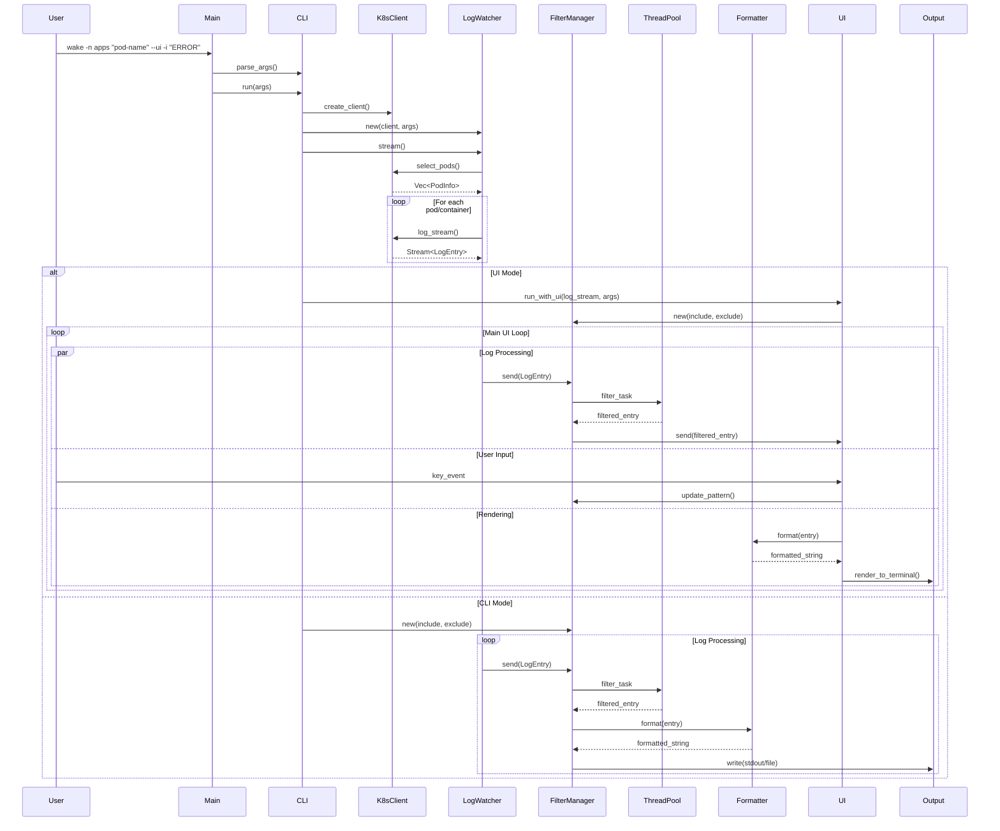

## 9. Threading and Concurrency Architecture

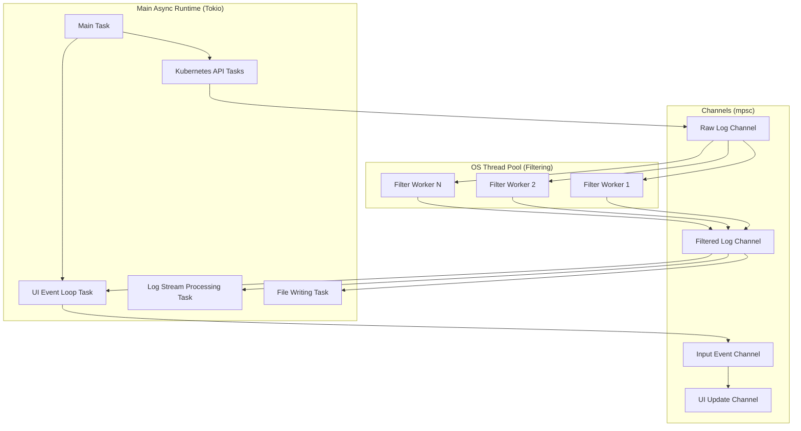

## 10. Error Handling and State Management

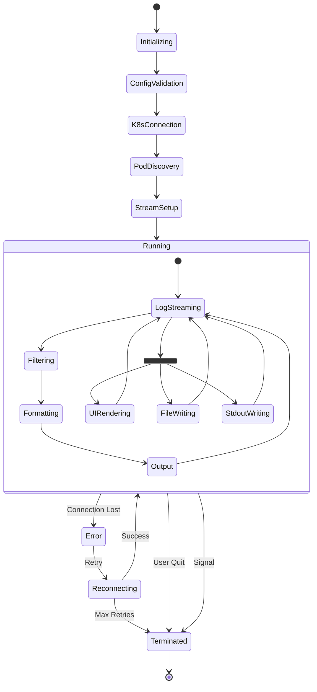

## 11. Configuration and Dependency Management

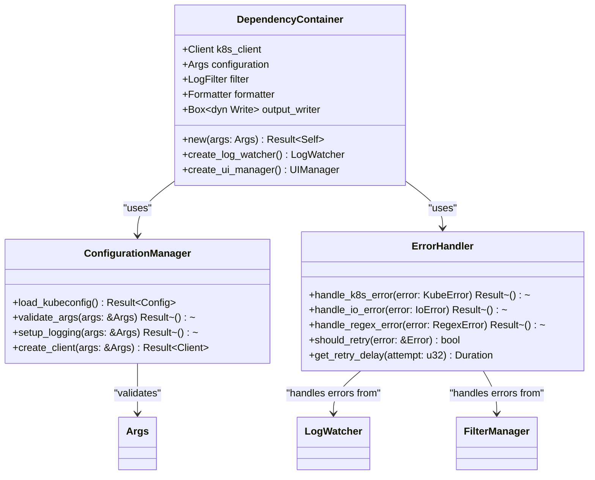

## 12. Memory Management and Performance

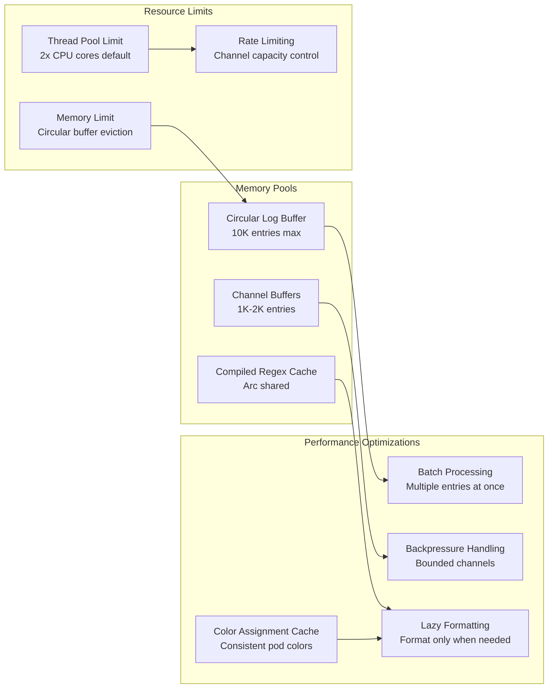

## 13. Testing Architecture

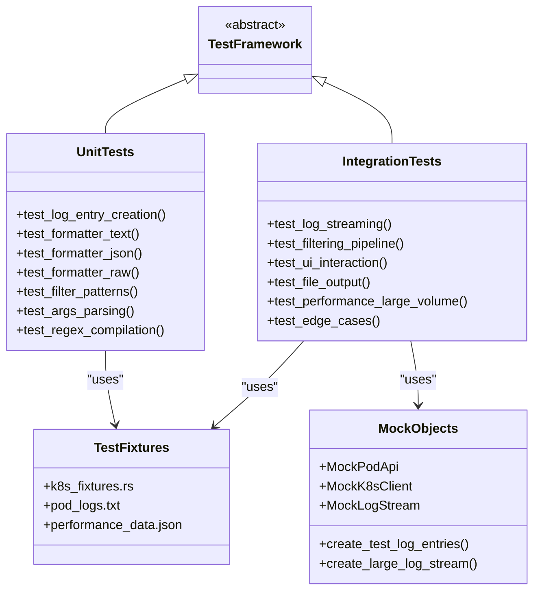

This comprehensive UML documentation covers every aspect of the Wake architecture, from high-level system design to detailed class relationships, data flows, concurrency patterns, and testing strategies. Each diagram provides specific implementation details gleaned from the actual codebase analysis.