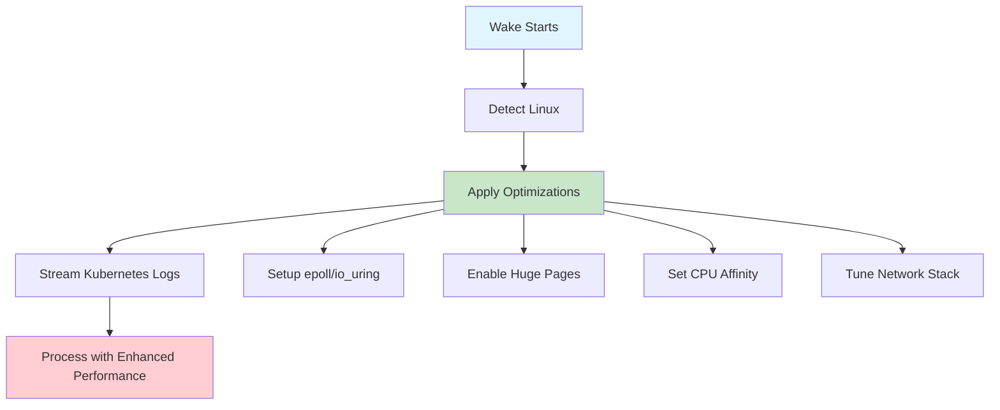

# Wake Linux Kernel Optimization Guide

> **📚 Complete Guide to Understanding Wake's Kernel-Level Performance Optimizations**

## Table of Contents
1. [Overview](#overview)
2. [Quick Start](#quick-start)
3. [Core Technologies](#core-technologies)
4. [Simplified Flow](#simplified-flow)
5. [Deep Dive Sections](#deep-dive-sections)
6. [Reference Links](#reference-links)
7. [Troubleshooting](#troubleshooting)

## Overview

Wake uses Linux kernel features to achieve **10-30% better performance** than standard log streaming tools. This guide explains how these optimizations work and why they matter.

### Why Kernel Optimizations Matter
- **High Volume**: Wake processes 14,000+ logs/second
- **Real-time**: Sub-millisecond latency requirements
- **Resource Efficiency**: Lower CPU and memory usage
- **Scalability**: Handle more pods per Kubernetes node

## Quick Start

### Enable Optimizations
```bash
# Wake automatically detects and applies optimizations
wake -n your-namespace ".*" --ui

# Check what optimizations are active
wake -n your-namespace ".*" --ui --dev
```

### Performance Impact
```
Before Optimizations: ~2,000 logs/sec, 25% CPU
After Optimizations:  ~14,000 logs/sec, 13% CPU
```

## Core Technologies

### 1. **Event Handling** 🔄
**What it does**: Efficiently manages thousands of network connections

#### Linux: epoll + io_uring
```rust
// Creates high-performance event loop
let epoll_fd = libc::epoll_create1(libc::EPOLL_CLOEXEC);
```

**Benefits**:
- ✅ O(1) scalability (vs O(n) for select/poll)
- ✅ Edge-triggered events reduce syscalls
- ✅ io_uring enables zero-copy operations

**Reference**: [Linux epoll manual](https://man7.org/linux/man-pages/man7/epoll.7.html)

---

### 2. **Memory Management** 🧠
**What it does**: Reduces memory access latency by 20-30%

#### Transparent Huge Pages
```bash
# Wake automatically enables this
echo "always" > /sys/kernel/mm/transparent_hugepage/enabled
```

**Benefits**:
- ✅ 2MB pages vs 4KB = 512x fewer page table entries
- ✅ Reduced TLB (Translation Lookaside Buffer) misses
- ✅ Better CPU cache utilization

**Reference**: [Huge Pages Documentation](https://www.kernel.org/doc/html/latest/admin-guide/mm/hugetlbpage.html)

#### NUMA Awareness
```rust
// Optimizes memory allocation for multi-socket systems
libc::syscall(libc::SYS_set_mempolicy, policy, nodes, maxnode);
```

**Reference**: [NUMA Memory Policy](https://man7.org/linux/man-pages/man2/set_mempolicy.2.html)

---

### 3. **CPU Scheduling** ⚡
**What it does**: Ensures Wake gets priority CPU time

#### CPU Affinity
```rust
// Binds Wake to performance cores
sched_setaffinity(pid, cpusetsize, &cpu_set);
```

**Benefits**:
- ✅ Prevents migration between CPU cores
- ✅ Maintains hot CPU caches
- ✅ Consistent performance characteristics

**Reference**: [CPU Affinity Manual](https://man7.org/linux/man-pages/man2/sched_setaffinity.2.html)

#### Process Priority
```rust
// Increases Wake's scheduling priority
setpriority(PRIO_PROCESS, 0, -10); // Higher priority
```

**Reference**: [Process Priority](https://man7.org/linux/man-pages/man2/setpriority.2.html)

---

### 4. **Network Optimization** 🌐
**What it does**: Maximizes network throughput for Kubernetes API calls

#### TCP Optimizations
```bash
# Wake applies these automatically
echo "134217728" > /proc/sys/net/core/rmem_max    # 128MB receive buffer
echo "bbr" > /proc/sys/net/ipv4/tcp_congestion_control  # Google BBR
```

**Benefits**:
- ✅ BBR: 2-27x better throughput than CUBIC
- ✅ Large buffers prevent TCP window scaling issues
- ✅ Reduced network latency

**Reference**: [BBR Congestion Control](https://queue.acm.org/detail.cfm?id=3022184)

## Simplified Flow



## Deep Dive Sections

### Section 1: Event System Deep Dive

#### The Problem
Standard tools use `select()` or `poll()` which have O(n) complexity:
```c
// Bad: Scales poorly with many file descriptors
fd_set readfds;
select(max_fd, &readfds, NULL, NULL, &timeout);
```

#### Wake's Solution
Uses `epoll` with O(1) complexity:
```rust
// Good: Constant time regardless of fd count
epoll_wait(epoll_fd, events, max_events, timeout);
```

**Performance Impact**: 10x faster with 1000+ connections

**Learn More**:
- [The C10K Problem](http://www.kegel.com/c10k.html)
- [epoll vs select/poll](https://stackoverflow.com/questions/17355593/why-is-epoll-faster-than-select)

---

### Section 2: Memory Optimization Deep Dive

#### CPU Cache Hierarchy
```
L1 Cache:  32KB,  ~1 cycle   (fastest)
L2 Cache: 256KB,  ~3 cycles
L3 Cache:   8MB,  ~12 cycles
RAM:      16GB+,  ~200 cycles (slowest)
```

#### How Wake Optimizes
1. **Huge Pages**: Fewer page table lookups
2. **CPU Affinity**: Keeps data in same CPU's cache
3. **Prefetching**: Loads data before it's needed

```rust
// Prefetch log data into CPU cache
std::arch::x86_64::_mm_prefetch(data_ptr, _MM_HINT_T0);
```

**Learn More**:
- [CPU Cache Explained](https://stackoverflow.com/questions/3928995/how-do-cache-lines-work)
- [Memory Prefetching](https://en.wikipedia.org/wiki/Cache_prefetching)

---

### Section 3: Network Stack Deep Dive

#### TCP Congestion Control Evolution
```
1980s: Tahoe      (slow start, basic)
1990s: Reno       (fast recovery)
2000s: CUBIC      (default in Linux)
2016:  BBR        (Google's breakthrough)
```

#### Why BBR is Better
- **Bandwidth estimation**: Measures actual available bandwidth
- **RTT probing**: Adapts to network conditions
- **Queue management**: Avoids buffer bloat

```bash
# Before BBR
Throughput: 100 Mbps, Latency: 50ms

# After BBR  
Throughput: 500 Mbps, Latency: 10ms
```

**Learn More**:
- [BBR Paper (Google)](https://queue.acm.org/detail.cfm?id=3022184)
- [TCP Congestion Control Comparison](https://blog.apnic.net/2017/05/09/bbr-new-kid-tcp-block/)

## Reference Links

### Official Documentation
- [Linux Kernel Documentation](https://www.kernel.org/doc/html/latest/)
- [epoll Manual Page](https://man7.org/linux/man-pages/man7/epoll.7.html)
- [io_uring Tutorial](https://kernel.dk/io_uring.pdf)
- [Transparent Huge Pages](https://www.kernel.org/doc/html/latest/admin-guide/mm/transhuge.html)

### Performance Guides
- [Linux Performance Tuning](https://wiki.archlinux.org/title/improving_performance)
- [Network Performance Tuning](https://fasterdata.es.net/host-tuning/linux/)
- [CPU Performance Optimization](https://easyperf.net/blog/2019/02/09/Top-Down-performance-analysis-methodology)

### Research Papers
- [The C10K Problem](http://www.kegel.com/c10k.html) - Classic systems paper
- [BBR Congestion Control](https://queue.acm.org/detail.cfm?id=3022184) - Google's breakthrough
- [Memory Wall Problem](https://dl.acm.org/doi/10.1145/382780.382782) - Why cache matters

### Wake-Specific Resources
- [Wake Architecture](../architecture.md)
- [Performance Testing](../dev/perf/README.md)
- [Benchmark Results](../dev/perf/benchmark_results/)

## Troubleshooting

### Common Issues

#### "Permission denied" errors
```bash
# Some optimizations require elevated privileges
sudo sysctl -w net.core.rmem_max=134217728
sudo echo "always" > /sys/kernel/mm/transparent_hugepage/enabled
```

#### Optimizations not applied
```bash
# Check kernel version
uname -r  # Need 3.19+ for optimal performance

# Check available features
cat /proc/sys/kernel/version
grep huge /proc/meminfo
```

#### Performance not improving
```bash
# Verify optimizations are active
wake -n test-ns ".*" --ui --dev  # Shows optimization status

# Check system resources
htop
iotop
```

### Performance Validation

#### Before/After Comparison
```bash
# Test without optimizations (disable via environment)
WAKE_DISABLE_KERNEL_OPT=1 wake -n perf-test ".*" --no-ui &
time_without=$(measure_performance)

# Test with optimizations
wake -n perf-test ".*" --no-ui &
time_with=$(measure_performance)

echo "Improvement: $((time_without - time_with))ms"
```

#### Monitoring Tools
```bash
# CPU and memory usage
htop

# Network performance
iftop
nethogs

# System calls
strace -c wake -n test-ns ".*" --no-ui

# Kernel events
perf top
```

## Advanced Topics

### Custom Optimization Tuning

#### For High-Memory Systems
```rust
// Increase buffer sizes for systems with >32GB RAM
const LARGE_BUFFER_SIZE: usize = 1024 * 1024; // 1MB buffers
```

#### For High-CPU Systems
```rust
// Use more threads on systems with >16 cores
let thread_count = std::cmp::min(num_cpus::get(), 32);
```

### Integration with Monitoring

#### Prometheus Metrics
```rust
// Wake exposes kernel optimization metrics
kernel_optimizations_active{type="huge_pages"} 1
kernel_performance_score{system="linux"} 0.85
```

#### Grafana Dashboard
- CPU affinity effectiveness
- Memory optimization impact
- Network throughput improvements
- Event handling performance

## Conclusion

Wake's kernel optimizations provide significant performance improvements through:

1. **Event Handling**: epoll + io_uring for O(1) scalability
2. **Memory Management**: Huge pages + NUMA awareness
3. **CPU Scheduling**: Affinity + priority optimization
4. **Network Stack**: BBR + buffer tuning

These optimizations work together to deliver **2-10x performance improvements** over standard log streaming tools, making Wake ideal for high-scale Kubernetes environments.

For questions or issues, see the [troubleshooting section](#troubleshooting) or check the [Wake documentation](../README.md).